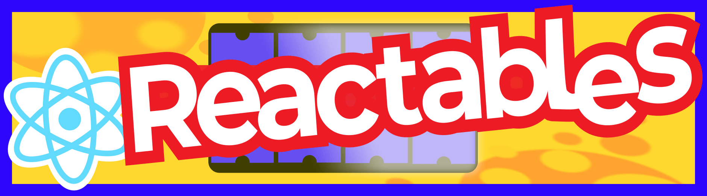

## Shrinkwrapped, portable and secure React components

Reactables are “react-in-a-box”. They enable you to bring the power of React and JSX to other languages. 
Consume and use them in your programming language of choice. Render from within.


### How it Works

The core component of Reactables is a module compiled to an [Extism](https://extism.org) plug-in using the 
JavaScript PDK. Let’s call it Reactable Core. Essentially, this is a Wasm module, `reactable.core.wasm`, that embeds React and JSX, 
along with an interface for compiling and rendering JSX templates.


### Example

The following example shows how to use the Reactable Core in a Ruby program by leveraging the Extism 
Ruby SDK. The same approach can be taken for other Host languages supported by Extism.

```ruby
require "extism"

url = "https://github.com/extism/reactables/releases/latest/download/reactable.core.wasm"
manifest = Extism::Manifest.from_url url
reactable = Extism::Plugin.new(manifest)

jsx_code = <<-JSX
export function App(props) {
  return <h1>Hello {props.customerName}!</h1>
}
JSX

# compile our JSX template
reactables.call('compileTemplate',
  JSON.generate(
    name: "greeting-template",
    code: jsx_code,
    isJSX: true
  )
)

# Render with customer specific props
html = reactables.call('render',
  JSON.generate(
    templateName: "greeting-template",
    props: { customerName: "Benjamin" },
  )
)

puts html
# => <h1>Hello Benjamin!</h1>
```

This demonstrates usage with a simple JSX component, but it's also possible to use ESBuild or Webpack to build a full blown JSX app, compile and 
render it with Reactable Core. This enables usage of all the usual tooling, styles, and even NPM. 

### How to build more Reactables from Reactable Core

Reactable Core can be extended to create new and novel Reactables that can render to additional targets (e.g., email, pdf, terminals, etc.)

Examples:
- https://github.com/resendlabs/react-email
- https://github.com/diegomura/react-pdf
- https://github.com/vadimdemedes/ink

### Github Action
Take a look at this Github Action to aid in your building of new Reactables