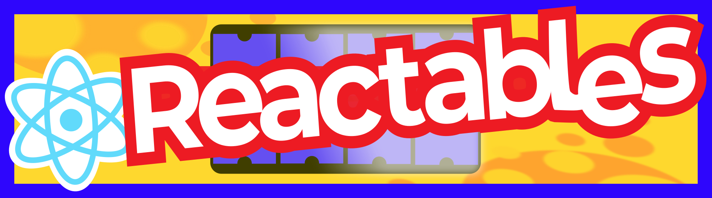
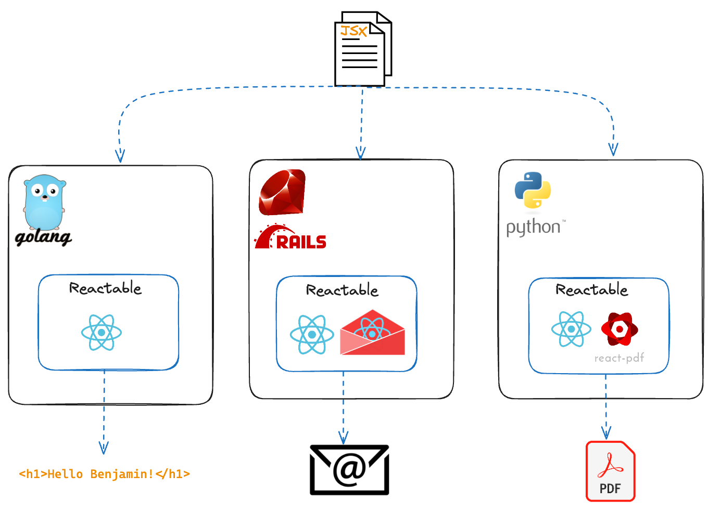

<div align="center">
    <p align="center">
      <picture>
          <source media="(prefers-color-scheme: dark)" srcset=".github/assets/reactables-wasm.png">
          
      </picture>
    </p>
    <h1 style="text-align: center;">Shrinkwrapped, Portable, <span>&#38;</span> Secure React Components</h1>
    
[Why](#why-reactables) · [Use Cases](#use-cases) · [Usage](#usage) · [Request Feature](https://github.com/dylibso/reactables/issues/new)

</div>

Reactables bring the power of React and JSX to everyone's programming language of choice.
Compile and render JSX templates securly from over 15 different programming languages including Python, Go, Java, Ruby, Dotnet, PHP, and more!

<p align="left">
 <picture>
      <source media="(prefers-color-scheme: dark)" srcset=".github/assets/reactables-diagram.png">
      
  </picture>
</p>

## Why Reactables?

There are many embeddable templating languages (e.g., Handlebars.js, Mustache, Liquid, etc.) in the world today, but most are not ideal for the following reasons:

- They lack expressivity and complexity turns messy (ie. non Turing-complete languages)
- They can be unfamiliar to many users and come with a non-zero learning curve
- They require users to leave all of their pre-built components behind and start from scratch
- They are incompatible with popular web development tools (e.g. Webpack, ESBuild, etc.)

In an ideal world, React/JSX could be used as a general purpose template engine and all of the above limitiations would fade
away, but alas:

- You can only embed in JavaScript. What if your code base is written in something else or you have multiple languages?
- What if your JSX templates are provided by a third party? That's not very secure...

These happen to be the two primary problems that [Extism](https://extism.org) aims to solve.
Reactables is built with [Extism](https://extism.org), so you can now compile and render React/JSX **safely** from within your programming language of choice.

## Use Cases

1. Your entire codebase is written in `<any_language_other_than_JavaScript>` but you really want/need to render templates with JSX
2. You're a SaaS platform and you want to give your customers the ability to customize various artifacts and touch points such as hosted pages, emails, and PDFs. 

## Features

- Run arbritrary JavaScript / JSX in your code **securely**!
- Suport for over 15 different host programming languages
- Incorporate your favorite tooling, styling, and NPM packages (experimental)
- Package up a full blown JSX app using ESBuild or Webpack
- Build and distribute new Reactables from your component library. They're customizable and portable!

## Ready to Consume

**Choose from pre-built Reactables that are ready to go out-of-the-box for your immediate enjoyment.** Each Reactable is implemented as 
a WebAssembly Module in the form of an [Extism Plugin](https://extism.org/docs/concepts/plug-in) that embeds React and other dependencies along with an interface to compile JSX templates and render them with supplied props. 

- **Reactable Core** provides a foundational plugin with React securely embedded to provide the core JSX compilation and rendering capabilities. Get it [here](https://github.com/dylibso/reactables/releases)

### Coming Soon
- **Reactable Email** extends Reactable Core with components from [react-email](https://github.com/resendlabs/react-email) 
- **Reactable PDF** extends Reactable Core  with components from [react-pdf](https://github.com/diegomura/react-pdf) 

## Usage

1. Include the appropriate [Extism SDK](https://extism.org/docs/quickstart/host-quickstart) into your application 
2. Instantiate your Reactable of choice as a new Extism Plugin 
3. Call the `compileTemplate` function with your JSX template
4. Call the `render` function with your props
5. Voila!

### Example (Python)

The following example embeds Reactable Core in a Python program to render a simple a JSX template with a customer name property. 
See the [examples directory](examples/) for examples in more languages.

```python
import extism
import json

plugin_url = "https://github.com/dylibso/reactables/releases/latest/download/reactable.core.wasm"
manifest = { "wasm": [ { "url": plugin_url } ] }
reactable = extism.Plugin(manifest, wasi=True)

# Take our JSX code as a string
jsx_code = """
function App(props) {
  return <h1>Hello, {props.customerName}!</h1>
}
"""

# Compile the template and register it by name
reactable.call('compileTemplate', json.dumps({
            "name": "greeting-template",
            "code": jsx_code,
            }))

# Render template by name, passing in some props
props = { "customerName": "Benjamin" }
html = reactable.call('render', json.dumps({
            "name": "greeting-template",
            "props": props,
            }))

print(html)
# <h1>Hello, Benjamin!</h1>
```

## Build your own 

Reactable Core can be extended to create new and novel Reactables that incorporate other components, styles, packages, etc.

